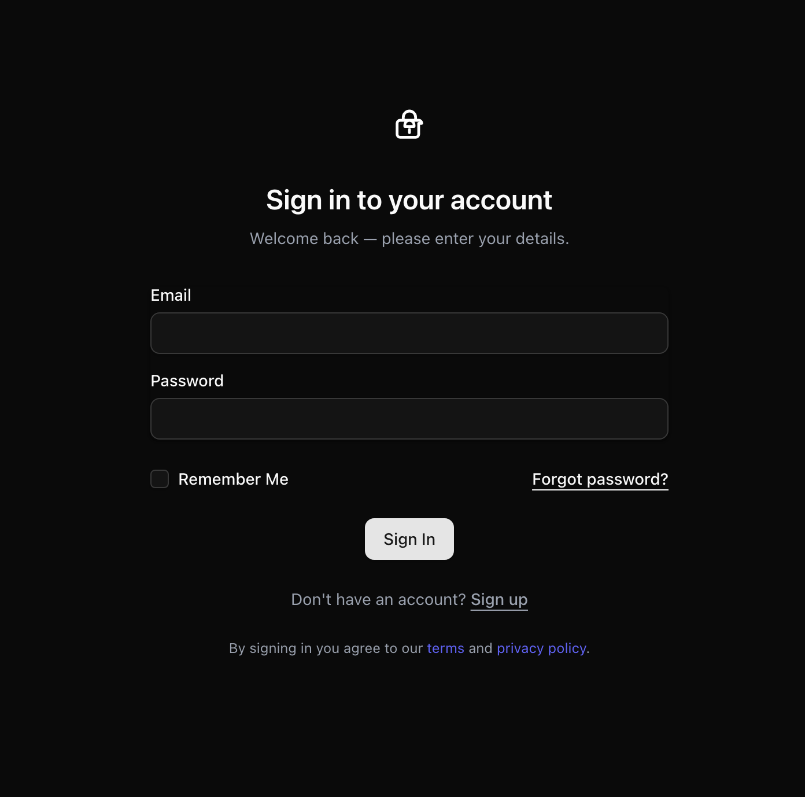

# Singlestage Login Example
Example login page for a Leptos web app using [Singlestage UI](https://singlestage.doordesk.net/)
# What it looks like


# Development
This example uses Tailwind's CDN to load Tailwind for Singlestage.
Ex.
```
<script src="https://cdn.jsdelivr.net/npm/@tailwindcss/browser"></script>
```

Change the theme using Singlestage's `ThemeProvider`.

To run
```
trunk serve --open
```
Open [http://localhost:8080](http://127.0.0.1:8080/)